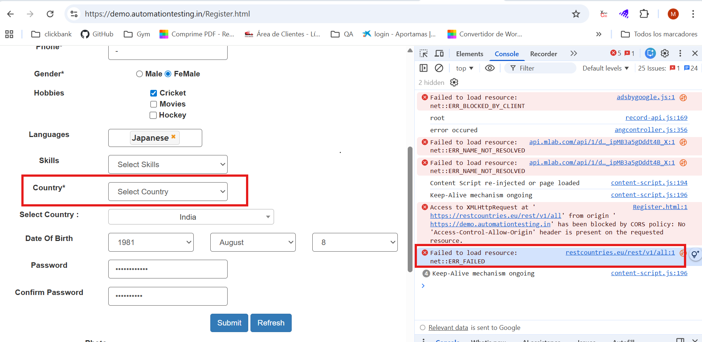
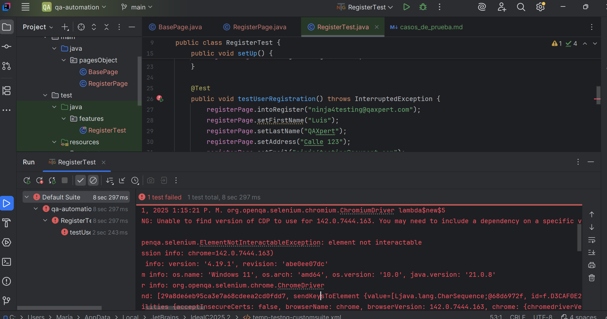

# Casos de Prueba en Gherkin – Registro de Nuevo Usuario

## Feature: Registro de nuevo usuario

Como usuario que desea crear una cuenta  
Quiero ingresar primero mi correo electrónico para acceder al formulario de registro completo  
Para poder completar mis datos personales y finalizar mi registro en la plataforma sin confusiones y de manera guiada.

---

## 1. Happy Path (Ruta Exitosa)

### Scenario: Registro exitoso con todos los campos obligatorios válidos
```
Given que estoy en la pantalla inicial de registro de usuario
And el campo "Email" está vacío
When ingreso un email válido
And hago clic en el botón "Continuar"
Then debo navegar al formulario de registro completo

When relleno el formulario de registro con datos válidos
And hago clic en el botón "Submit"
Then el registro debe ser exitoso
And debo ver una confirmación de registro correcto
```
---
## 2. Escenarios Negativos:

### Scenario 01: Intento de registro los campos obligatorios vacíos en el formulario 
```
Given que estoy en la pantalla inicial de registro de usuario
When ingreso un email válido
And hago clic en el botón "Continuar"
Then debo navegar al formulario de registro completo

When dejo los campos obligatorios vacíos en el formulario
And hago clic en el botón "Submit"
Then se muestra una alerta en el primer campo obligatorio "Full Name" indicando que debes rellenarlo
```

### Scenario 02: Intento de registro con número de teléfono inválido en el formulario
```
Given que estoy en la pantalla inicial de registro de usuario
When ingreso un email válido
And hago clic en el botón "Continuar"
Then debo navegar al formulario de registro completo

When introduzco un número de teléfono inválido en el campo "Phone"
And hago clic en el botón "Submit"
Then se muestra una alerta indicando que utilice un formato que coincida con el solicitado
```

### Scenario 03: Mismatch entre Password y Confirm Password en el formulario
```
Given que estoy en la pantalla inicial de registro de usuario
When ingreso un email válido
And hago clic en el botón "Continuar"
Then debo navegar al formulario de registro completo

When introduzco una password en el campo Confirm Password que no coincide con la del campo Password
And hago clic en el botón "Submit"
Then se debería mostrar una alerta indicando que las passwords no coinciden
```
**NOTA:** No se puede llegar a comprobar el último escenario negativo (Mismatch entre Password y Confirm Password en el formulario),
por causas ajenas al código. Es debido a un comportamiento erróneo del sitio web. El problema es que no funciona
el dropdown "Country" y es consecuencia de una llamada a un endpoint que no funciona (https://restcountries.eu/rest/v1/all) por lo
que no se puede seleccionar ningún país.
Capturas de pantalla con la evidencia: 




